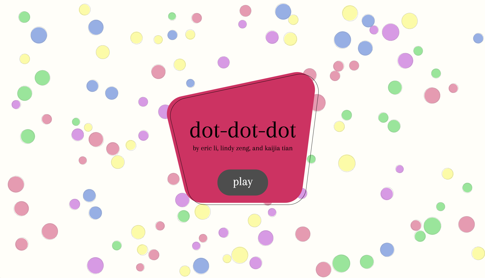

dot-dot-dot
===


dot-dot-dot is a game in which particle physics meets connect the dots. It is based off the mobile game Dots and is implemented using PIXI and modern JavaScript conventions.

To install, clone the repository and run:

```
npm i
npm run build
npm run watch
```

In a separate shell window, run ```npm run start```. Then visit ```localhost:8000```.
